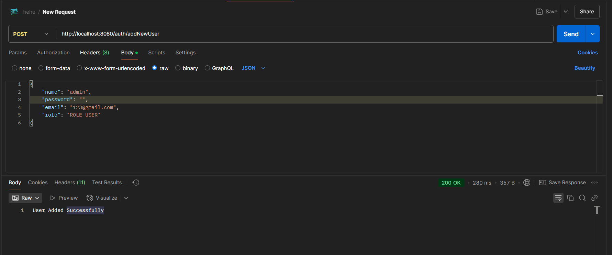

# Spring Boot 3 Security Demo

This project is a demo application showcasing the integration of Spring Boot 3 with Spring Security, JWT authentication, and MySQL database.

## Features

- User and Admin roles with different access levels
- JWT-based authentication and authorization
- Secure REST API endpoints
- User registration and login
- Password encryption using BCrypt
- Integration with MySQL database

## Technologies Used

- Spring Boot 3
- Spring Security
- JSON Web Token (JWT)
- MySQL
- JPA/Hibernate
- Lombok
- Maven

## Getting Started

### Prerequisites

- Java 17
- Maven
- MySQL

### Setup

1. Clone the repository:

   ```sh
   git clone https://github.com/your-repo/springboot3-security-demo.git
   cd springboot3-security-demo/demo
   ```

2. Configure the MySQL database in [application.properties](http://_vscodecontentref_/1):

   ```properties
   spring.datasource.url=jdbc:mysql://localhost:3306/university
   spring.datasource.username=root
   spring.datasource.password=yourpassword
   ```

3. Build the project using Maven:

   ```sh
   ./mvnw clean install
   ```

4. Run the application:
   ```sh
   ./mvnw spring-boot:run
   ```

### API Endpoints

- `POST /auth/addNewUser` - Register a new user
- `POST /auth/generateToken` - Authenticate and get a JWT token
- `GET /auth/welcome` - Public endpoint
- `GET /auth/user/userProfile` - User profile (requires ROLE_USER)
- `GET /auth/admin/adminProfile` - Admin profile (requires ROLE_ADMIN)
- `POST /api/admin/create` - Create a new resource (requires ROLE_ADMIN)
- `PUT /api/admin/update` - Update a resource (requires ROLE_ADMIN)
- `DELETE /api/admin/delete` - Delete a resource (requires ROLE_ADMIN)
- `GET /api/user/profile` - Get user profile information (requires ROLE_USER)

## Demo

### Add New User



### Generate Token


### User Welcome Page With JWT


### Welcome Page Without JWT


### Cannot Access Admin Welcome Page Without JWT


