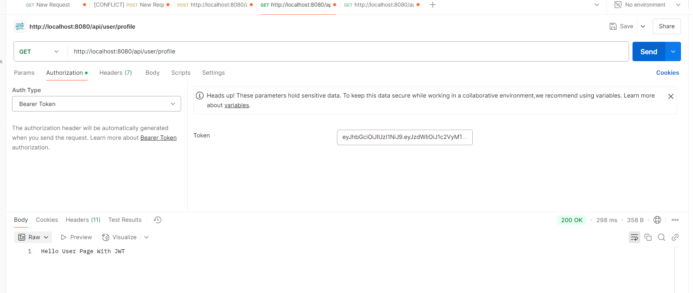

# Spring Boot 3 Security Demo

This project is a demo application showcasing the integration of Spring Boot 3 with Spring Security, JWT authentication, and MySQL database.

## Features

- User and Admin roles with different access levels
- JWT-based authentication and authorization
- Secure REST API endpoints
- User registration and login
- Password encryption using BCrypt
- Integration with MySQL database

## Technologies Used

- Spring Boot 3
- Spring Security
- JSON Web Token (JWT)
- MySQL
- JPA/Hibernate
- Lombok
- Maven

## Getting Started

### Prerequisites

- Java 17
- Maven
- MySQL

### Setup

1. Clone the repository:

   ```sh
   git clone https://github.com/your-repo/springboot3-security-demo.git
   cd springboot3-security-demo/demo
   ```

2. Configure the MySQL database in [application.properties](http://_vscodecontentref_/1):

   ```properties
   spring.datasource.url=jdbc:mysql://localhost:3306/university
   spring.datasource.username=root
   spring.datasource.password=yourpassword
   ```

3. Build the project using Maven:

   ```sh
   ./mvnw clean install
   ```

4. Run the application:
   ```sh
   ./mvnw spring-boot:run
   ```

### API Endpoints

#### Authentication and Authorization

- POST /api/auth/register - Register a new user
- POST /api/auth/login - Authenticate and get a JWT token
- GET /api/auth/welcome - Public endpoint

#### User Endpoints

- GET /api/user/profile - User profile (requires ROLE_USER)

#### Admin Endpoints

- GET /api/admin/profile - Admin profile (requires ROLE_ADMIN)
- POST /api/admin/resources - Create a new resource (requires ROLE_ADMIN)
- PUT /api/admin/resources/{id} - Update a resource (requires ROLE_ADMIN)
- DELETE /api/admin/resources/{id} - Delete a resource (requires ROLE_ADMIN)

#### Account Management Endpoints

- GET /api/accounts - Get all user accounts (requires ROLE_ADMIN)
- POST /api/accounts - Add a new user account (requires ROLE_ADMIN)
- PUT /api/accounts/{id} - Update a user account (requires ROLE_ADMIN)
- DELETE /api/accounts/{id} - Delete a user account (requires ROLE_ADMIN)

## Demo

### Welcome Page


### Register a New User


### Login and Get JWT Token


### User Profile



### Account List with JWT


### Update Account with JWT


### Delete Account with JWT


